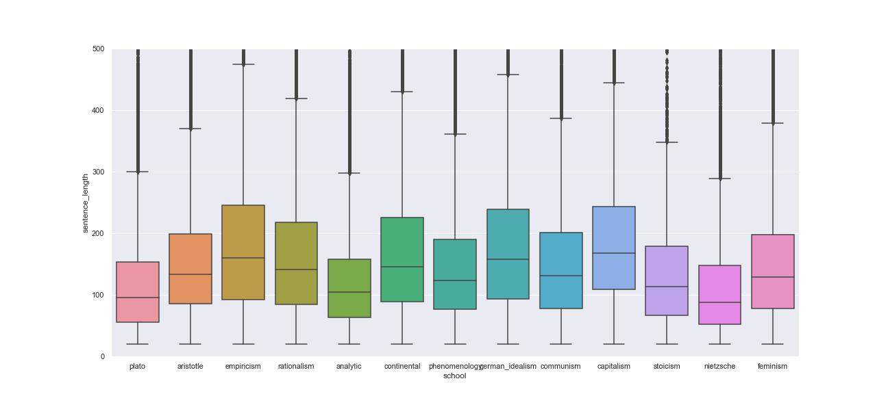
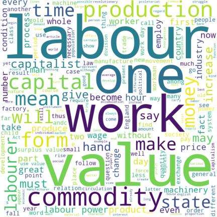
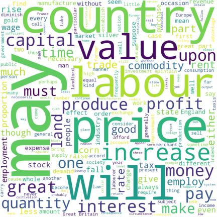
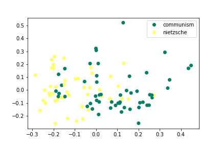
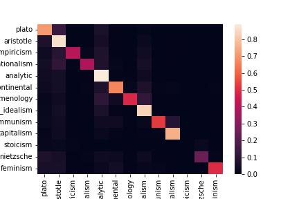
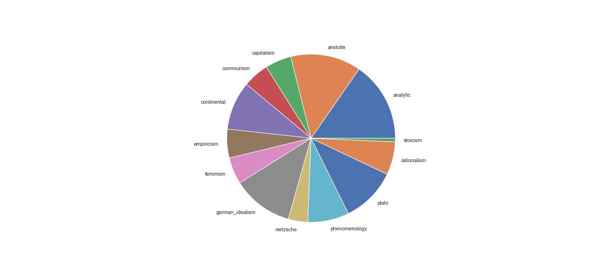
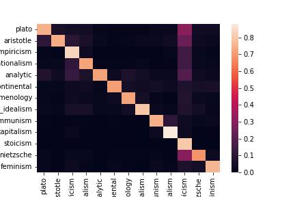
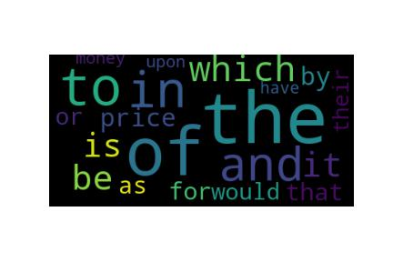
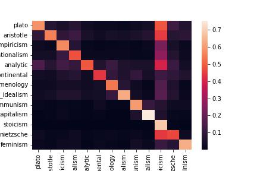
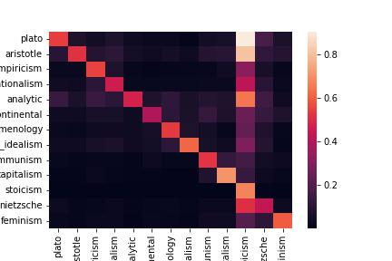

# Who Said This?
## Philosophy from a data point of view

__sg4010 Sibo Geng__

"One should only speak where one cannot remain silent, and only speak of what one has conquered —the rest is all chatter, “literature,” bad breeding." --Friedrich Nietzsche

I chose this quote from Nietzche not because it strike a particular chord in my heart, instead, I picked it because it set me wondering, what is the idea behind this sentence the philosopher is trying to convey? Luckily, I have data to my aid. To best utilize the data at hand, I decided to address the the challange as a supervised learning problem. Namely, the goal is to develop an algorithm that predict the school of philosophy a given sentence belongs to.

## Exploratory Data Analysis
First, let's get our hands dirty and have a look at how the data's been processed


```python
import pandas as pd
df = pd.read_csv("../data/philosophy_data.csv")
df.head()
```


<div>
<style scoped>
    .dataframe tbody tr th:only-of-type {
        vertical-align: middle;
    }

    .dataframe tbody tr th {
        vertical-align: top;
    }
    
    .dataframe thead th {
        text-align: right;
    }
</style>
<table border="1" class="dataframe">
  <thead>
    <tr style="text-align: right;">
      <th></th>
      <th>title</th>
      <th>author</th>
      <th>school</th>
      <th>sentence_spacy</th>
      <th>sentence_str</th>
      <th>original_publication_date</th>
      <th>corpus_edition_date</th>
      <th>sentence_length</th>
      <th>sentence_lowered</th>
      <th>tokenized_txt</th>
      <th>lemmatized_str</th>
    </tr>
  </thead>
  <tbody>
    <tr>
      <th>0</th>
      <td>Plato - Complete Works</td>
      <td>Plato</td>
      <td>plato</td>
      <td>What's new, Socrates, to make you leave your ...</td>
      <td>What's new, Socrates, to make you leave your ...</td>
      <td>-350</td>
      <td>1997</td>
      <td>125</td>
      <td>what's new, socrates, to make you leave your ...</td>
      <td>['what', 'new', 'socrates', 'to', 'make', 'you...</td>
      <td>what be new , Socrates , to make -PRON- lea...</td>
    </tr>
    <tr>
      <th>1</th>
      <td>Plato - Complete Works</td>
      <td>Plato</td>
      <td>plato</td>
      <td>Surely you are not prosecuting anyone before t...</td>
      <td>Surely you are not prosecuting anyone before t...</td>
      <td>-350</td>
      <td>1997</td>
      <td>69</td>
      <td>surely you are not prosecuting anyone before t...</td>
      <td>['surely', 'you', 'are', 'not', 'prosecuting',...</td>
      <td>surely -PRON- be not prosecute anyone before ...</td>
    </tr>
    <tr>
      <th>2</th>
      <td>Plato - Complete Works</td>
      <td>Plato</td>
      <td>plato</td>
      <td>The Athenians do not call this a prosecution b...</td>
      <td>The Athenians do not call this a prosecution b...</td>
      <td>-350</td>
      <td>1997</td>
      <td>74</td>
      <td>the athenians do not call this a prosecution b...</td>
      <td>['the', 'athenians', 'do', 'not', 'call', 'thi...</td>
      <td>the Athenians do not call this a prosecution ...</td>
    </tr>
    <tr>
      <th>3</th>
      <td>Plato - Complete Works</td>
      <td>Plato</td>
      <td>plato</td>
      <td>What is this you say?</td>
      <td>What is this you say?</td>
      <td>-350</td>
      <td>1997</td>
      <td>21</td>
      <td>what is this you say?</td>
      <td>['what', 'is', 'this', 'you', 'say']</td>
      <td>what be this -PRON- say ?</td>
    </tr>
    <tr>
      <th>4</th>
      <td>Plato - Complete Works</td>
      <td>Plato</td>
      <td>plato</td>
      <td>Someone must have indicted you, for you are no...</td>
      <td>Someone must have indicted you, for you are no...</td>
      <td>-350</td>
      <td>1997</td>
      <td>101</td>
      <td>someone must have indicted you, for you are no...</td>
      <td>['someone', 'must', 'have', 'indicted', 'you',...</td>
      <td>someone must have indict -PRON- , for -PRON- ...</td>
    </tr>
  </tbody>
</table>
</div>


Much to our convenience, the data has been thoroughly preprocessed. Here is a illustration of the process.


```python
# illustration of data preprocessing pipeline
x = df.iloc[9]

print('''raw data: \n{}\n\nlowered: \n{}\n\ntokenized: \n{}\n\nlemmatized:\n{}\n'''.format( \
            x['sentence_spacy'], x['sentence_lowered'], x['tokenized_txt'], x['lemmatized_str'] ))
```

    raw data: 
    He belongs to the Pitthean deme, if you know anyone from that deme called Meletus, with long hair, not much of a beard, and a rather aquiline nose.
    
    lowered: 
    he belongs to the pitthean deme, if you know anyone from that deme called meletus, with long hair, not much of a beard, and a rather aquiline nose.
    
    tokenized: 
    ['he', 'belongs', 'to', 'the', 'pitthean', 'deme', 'if', 'you', 'know', 'anyone', 'from', 'that', 'deme', 'called', 'meletus', 'with', 'long', 'hair', 'not', 'much', 'of', 'beard', 'and', 'rather', 'aquiline', 'nose']
    
    lemmatized:
     -PRON- belong to the Pitthean deme , if -PRON- know anyone from that deme call Meletus , with long hair , not much of a beard , and a rather aquiline nose .


Although the text has already been cleaned and lemmatized, it still can't be fed to machines directly. We have to figure out a representation technique that map the text data to numerical values. A most naive while direct way will be taking the length of the sentence. After all some people like to use short and curt sentence, while others prefer more sophisticated expression.


Apparently philosophers from different schools have different prefrence in sentence length, where scholars from __empiricism__ and __capitalism__ wrote the longest verses while __Nietzche__ himself wrote the shortest sentence among all schools. However sentence length all by itself does not carry enough information for us to distinguish between different schools in philosophy. For instance, a sentence of 150 words can easily belong to any track.

To generate more specific features for each sentence, we need to dive a little deeper about the choice of word each philosopher used.

Communism                 | Capitalism             
- | -
 | 

From the wordcloud shown above(larger fonts indicate higher frequency of use), we can see that the favorite vocabulary of different schools of philosophy differs significantly. Thus, by counting the apperances of words in a sentence sounds like a reasonable way to represent the sentence.

In order to have a rough estimate of the difficulty of the task, I first sampled 200 sentences from two schools, namely, __communism__ and __Nietzche__, and calculated their features via the "Term Frequency — Inverse Document Frequency" technique. Then I conducted a PCA that mapped the feature space into only two dimensions for the sake of visualization. The results are as follows:


It can be seen from the scatter plot that most of the green dots are distributed on the left side of the graph, while the yellow ones are on the right. Note that the PCA process did not utilize any information concerning the school of the sentence, i.e., it is unsupervised. The result gave us hope that the __tf-idf__ feature would serve as a good feature for classification task.

## Naive Bayes Model
So far, we have had a rough idea of what the data looks like, and a scheme worked out to extract features from the data. In this section, I will use a __Naive Bayes Model__ to categorize each sentence to corresponding school.

With Train/Test set splitted randomly, and a model fitted, we are ready to check out the result:


The __y-axis(vertical)__ represents the ground truth label of the sentence, while the __x-aixs(horizonal)__ indicates the prediction of the model. A lighter color a certain grid has, the greater probability the model prediction falls in the corresponding school, while a darker color shows the opposite. Several interesting findings caught my eyes.

### 1. A relatively high error rate for sentences from Stoicism
In general, our model performed pretty good, and most of the diagonal grids of the matrix have lighter color, indicating the prediction by our model is correct.However,the model falsely predicts many sentences from __Stoicism__ as other school's. After a closer look, I found this phenomenon can be explained by the imbalanced distribution of training data.

As shown by the pie chart above, the sentence number from stoicism takes up the smallest proportion among all training data. With some over-sampling from the minor categories, we are able to alleviate the problem.

before                 | after             
- | -
 | 

### 2. Dimension of feature space is too large
The featurization method we used here is equivalent to creating a one-hot vector whose length is equal to the number of vocabulary present in all texts. Such a feature vector is easy to create, but due to its large scale, it becomes impossible to run many machine learning algorithms in reasonable time. Are all these dimensions/words equally important to our classification task? Luckily we can derive each word's importance from the coeficients of the trained __Naive Bayes__ model.

model learned | frequency
- | -
 | 

The left word cloud shows the words that the model found most __informative__ that suggest a sentence belongs to school __Capitalism__. The right word cloud is the most frequent words that appear in __Capitalism__ philosophers' works. We see that the model deemed words like "money" and "price" of great importance, which is in accordance with our intuition.

The above study gives us an inspiration that we may only consider the union of most important words for all schools to help reduce the size of vocabulary, thus reducing our feature dimension.

Pursuing this track of thought, I conducted a comparison experiment. The configurations are as follow:

 config| Experiment | Baseline
 - | - | -
 feature | Union of top features by original NB model | Words of highest frequency, same size as exp config
  confusion matrix | | 
  F1 score | 0.56 | 0.53

From the confusion matrix shown above, we can easily see that by utilizing knowledge obtained by __Naive Bayes__ model, we are able to better select features. The quantative result also supports the conclusion.

## Application

I pulled from the internet several quotes from former president __Donald Trump__. The original data looks like this:


```python
test_df = pd.read_csv("../data/trump_quote.csv")
test_df.head()
```


<div>
<style scoped>
    .dataframe tbody tr th:only-of-type {
        vertical-align: middle;
    }

    .dataframe tbody tr th {
        vertical-align: top;
    }
    
    .dataframe thead th {
        text-align: right;
    }
</style>
<table border="1" class="dataframe">
  <thead>
    <tr style="text-align: right;">
      <th></th>
      <th>raw_data</th>
    </tr>
  </thead>
  <tbody>
    <tr>
      <th>0</th>
      <td>I deal with foreign countries. I made a lot of...</td>
    </tr>
    <tr>
      <th>1</th>
      <td>With the coldest winter ever recorded, with sn...</td>
    </tr>
    <tr>
      <th>2</th>
      <td>I don't like to sit back and gloat, because th...</td>
    </tr>
    <tr>
      <th>3</th>
      <td>This very expensive GLOBAL WARMING bullshit ha...</td>
    </tr>
    <tr>
      <th>4</th>
      <td>A lot of people want me to run for things, for...</td>
    </tr>
  </tbody>
</table>
</div>


Interesting enough, our model categorized 3 out of the 5 quotes as of school __Plato__. One possible explanation is that in his work _The Republic_, __Plato__ wrote his lines in conversations, using many first personal pronouns, which is just like the quotes from __Trump__.

## Summary

To draw a conclusion of this project, we have explored the text data, looked into the subject of hand-crafted feature for text data, and trained a compact but pretty decent model to predict the label of sentences, and finally used it on some real-world test data. The take home message are:

1. sentence length is informative, but not deterministic.
2. unbalanced class distribution may affect NB model performance, oversampling can help.
3. the most frequently appeared words are not necesssarily the most _important_ ones.
4. deep in his heart, Donald Trump believes in Plato's idea.

## Refrence

1. data cleansing pipeline: https://towardsdatascience.com/preprocessing-text-data-using-python-576206753c28
2. matplotlib usage: http://c.biancheng.net/matplotlib/boxplot.html
3. PCA: https://stackoverflow.com/questions/28160335/plot-a-document-tfidf-2d-graph
4. machine learning pipeline(data preparation, metrics): https://www.kaggle.com/ludovicocuoghi/detecting-bullying-tweets-w-pytorch-bi-lstm/notebook
5. sci-kit learn Naive Bayes model interpretation: https://stackoverflow.com/questions/50526898/how-to-get-feature-importance-in-naive-bayes
6. wordcloud visualization: https://stackoverflow.com/questions/62563242/how-to-visualize-the-size-of-a-word-depending-on-its-value
7. Donald Trump quotes: https://www.inspiringquotes.us/author/8279-donald-trump

